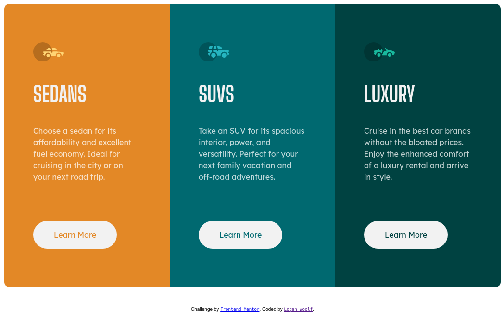

# Frontend Mentor - 3-column preview card component solution

This is a solution to the [3-column preview card component challenge on Frontend Mentor](https://www.frontendmentor.io/challenges/3column-preview-card-component-pH92eAR2-). Frontend Mentor challenges help you improve your coding skills by building realistic projects. 

## Table of contents

- [Overview](#overview)
  - [The challenge](#the-challenge)
  - [Screenshot](#screenshot)
  - [Links](#links)
- [My process](#my-process)
  - [Built with](#built-with)
  - [What I learned](#what-i-learned)
  - [Continued development](#continued-development)
  - [Useful resources](#useful-resources)
- [Author](#author)
- [Acknowledgments](#acknowledgments)

## Overview

### The challenge

Users should be able to:

- View the optimal layout depending on their device's screen size
- See hover states for interactive elements

### Screenshots




### Links

- Solution URL: [https://www.frontendmentor.io/solutions/html-and-css-grid-3-column-layout-BkfKb8ZSG](https://www.frontendmentor.io/solutions/html-and-css-grid-3-column-layout-BkfKb8ZSG)
- Live Site URL: [https://loganwoolf.github.io/FM-3-column-preview/](https://loganwoolf.github.io/FM-3-column-preview/)

## My process

### Built with

- Semantic HTML5 markup
- CSS custom properties
- CSS Grid
- Mobile-first workflow
- Git and GitHub

### What I learned

- I used CSS Grid and it felt very intuitive on this project.
```
.grid-container {
  margin: 5px;
  display: grid;
  grid-template-columns: auto;
  justify-content: center;
  min-width: 310px;
}
```
- Mobile first development meant to make it wide for desktop was to just add more columns in the `@media` query.
```
.grid-container {
    grid-template-columns: auto auto auto;
    justify-content: center;
  }
```
- Creating CSS custom properties first thing made coloring items very easy once it came time to do that.
```
:root {
  --bg-1-color: hsl(31, 77%, 52%);
  --bg-2-color: hsl(184, 100%, 22%);
  --bg-3-color: hsl(179, 100%, 13%);
  --p-color: hsla(0, 0%, 100%, 0.75);
  --h-color: hsl(0, 0%, 95%);
}
```
- `ch` units are wonderful for max- or min-sizing text blocks.
```
.card {
  max-width: 30ch;
  padding: 50px;
}
```
- Emmet was used to create the `body` contents, expanding maybe two strings. Powerful. 
- Git and GitHub.com were used for regular commits and pushes to remote.

### Continued development

- I am still not totally comfortable with font sizes in CSS, especially when it comes to using `%` units.
- Centering items not inside a flex or grid container is a real PITA.

### Useful resources

- [grid.malven.co](https://grid.malven.co) - This grid cheat sheet always comes in handy.

## Author

- Website - [Logan Woolf](https://loganwoolf.github.io/)
- Frontend Mentor - [@loganwoolf](https://www.frontendmentor.io/profile/loganwoolf)
- Twitter - [@logan__woolf](https://www.twitter.com/logan__woolf)

## Acknowledgments

Thank you to FrontendMentor.com. These projects are perfect for self-teaching.